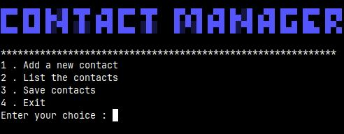

# Contact Manager


A simple and beginner-friendly Contact Manager built with Python.
This command-line application allows users to manage contacts by adding, listing, and saving them into a local file.

---

## Preview



---

## Features

*  Add new contacts (name and phone number)
*  Display all contacts
*  Save contacts to a local file (`Donnee.txt`)
*  Exit the application

---

## Built With

* Python 3
* File handling
* Command-Line Interface (CLI)

---

## 📂 Project Structure

```id="f08cjr"
.
├── main.py
├── .gitignore
├── screenshot.png
└── README.md
```

---

## About `Donnee.txt`

The file `Donnee.txt` is **not included in this repository** because it is listed in `.gitignore`.

👉 This file is generated automatically when you save contacts.

---

## Getting Started

### 1. Clone the repository

```id="m87fui"
git clone https://github.com/ralijaonafehizoro961-wq/Contact_Manager.git
cd Contact_Manager
```

### 2. Run the program

```id="u6vr3z"
python3 main.py
```

---

## Usage

```id="aivtx0"
========== CONTACT MANAGER ==========
1. Add a new contact
2. List the contacts
3. Save contacts
4. Exit
```

---

## 🔧 Future Improvements

*  Search contacts
*  Edit contacts
*  Delete contacts
*  Load contacts automatically
*  Use JSON or a database
*  Add GUI

---

## 👨‍💻 Author

* Fehizoro RALIJAONA
* GitHub: https://github.com/ralijaonafehizoro961-wq
